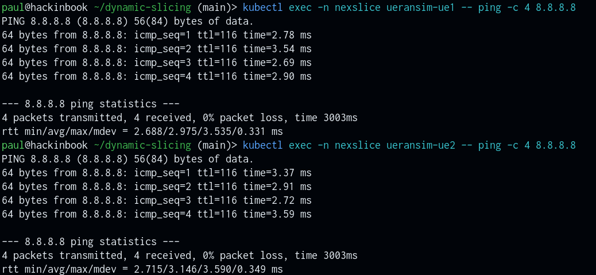
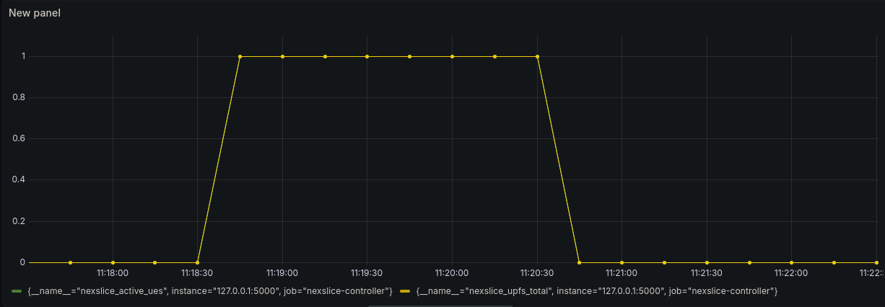

# NexSlice — Contrôleur de Slicing Dynamique 5G

**Auteurs :** Lardet Paul et Jarlan Benoit  
**Date :** 30 novembre 2025

---

## 1. État de l'Art

### 1.1. Introduction et Contexte du Projet

Dans sa version actuelle, NexSlice implémente un découpage réseau (slicing) statique : les fonctions réseaux virtuelles (VNFs), telles que le SMF (*Session Management Function*) et l'UPF (*User Plane Function*), sont pré-allouées dans le cluster Kubernetes lors du déploiement initial.

**Objectif du Slicing Dynamique**

Le scénario cible vise à illustrer le comportement suivant :
*   **Connexion :** Lorsqu'un UE s'attache au gNB, un UPF dédié est instancié automatiquement (via script ou opérateur).
*   **Déconnexion :** Lorsque l'UE se détache, l'UPF est détruit pour libérer les ressources.

> *Note : Le périmètre se limite à la création dynamique de l'UPF, le SMF restant statique.*

### 1.2. Cadre de Référence : Architecture 3GPP

L'implémentation de ce projet repose sur les concepts fondamentaux de la 5G Standalone (SA) définis par le 3GPP.

**Séparation CUPS (Control and User Plane Separation)**

Introduite dans la Release 14 et native dans la 5G (TS 23.501), la séparation CUPS est le catalyseur de ce projet. Elle dissocie :
*   **Le Plan de Contrôle (SMF) :** Cerveau du réseau, il gère la signalisation et la sélection du nœud de données.
*   **Le Plan Utilisateur (UPF) :** Muscle du réseau, il route les paquets et peut être instancié à la demande.

**Identification du Slice (S-NSSAI)**

Chaque tranche réseau est identifiée par un **S-NSSAI** (*Single Network Slice Selection Assistance Information*), composé d'un SST (*Slice Service Type*) et d'un SD (*Slice Differentiator*). C'est cet identifiant, transmis lors de la requête d'enregistrement de l'UE, qui servira de déclencheur (*trigger*) pour l'instanciation dynamique.

### 1.3. Orchestration Cloud-Native et Kubernetes

L'état de l'art industriel s'éloigne des scripts impératifs pour adopter le modèle déclaratif de Kubernetes.

**Le Pattern "Opérateur Kubernetes"**

Contrairement à un script Bash qui s'exécute une fois, un Opérateur est un programme qui tourne en boucle dans le cluster pour réconcilier l'état réel avec l'état désiré.

> **Boucle de Réconciliation : Observe → Analyze → Act.**
> *   **Avantage :** Gestion automatique des pannes (Self-healing). Si l'UPF de l'UE crashe, l'opérateur le redémarre.
> *   **Implémentation :** Utilisation de CRDs (*Custom Resource Definitions*) pour définir un objet `UE-Slice`.

**Défis Techniques Identifiés**

1.  **Latence de démarrage (Cold Start) :** L'instanciation d'un Pod UPF prend plusieurs secondes. Il faut s'assurer que les timers de connexion de l'UE (au niveau NAS/RRC) n'expirent pas avant que l'UPF ne soit prêt.
2.  **Reconfiguration du SMF :** Le SMF doit être notifié dynamiquement de l'adresse IP du nouvel UPF pour établir l'association PFCP (port 8805), ce qui n'est pas standard dans les déploiements statiques.

### 1.4. État de l'Art des Solutions Open-Source

Le tableau ci-dessous synthétise les dépôts GitHub et projets existants pouvant servir de base technologique pour NexSlice.

| Projet / Dépôt | Technologie | Apport pour NexSlice | Limites |
| :--- | :--- | :--- | :--- |
| **Gradiant** (open5gs-operator) | Opérateur K8s, CRDs | Fournit un cadre "Opérateur" complet pour Open5GS. Idéal pour comprendre la logique. | Ne gère pas le "1 UE = 1 UPF" par défaut. Nécessite modification. |
| **KEDA / Aether** | Event-driven Autoscaling | **Brique clé.** Permet de scaler des Pods sur événements (métriques ou logs). | Nécessite de définir une métrique personnalisée précise pour détecter l'UE. |
| **Prometheus & Webhooks** | Scripting Python | Approche réactive simple (Alerte → Script). Bon pour un prototype rapide. | Souvent basé sur Docker Compose, moins robuste que K8s natif. |
| **HEXAeBPF** | Opérateur, eBPF | Très haute performance. Montre l'avenir de l'UPF. | Complexité technique trop élevée pour une démo fonctionnelle. |
| **towards5gs-helm** | Helm Charts | Base de déploiement très stable pour le cœur de réseau initial. | Déploiement purement statique. Aucune logique dynamique. |
| **niloysh** (open5gs-k8s) | Monitoring | Excellent pour visualiser les KPIs des slices créés. | Se concentre sur l'observation, pas sur l'action d'instanciation. |

---

## 2. Méthode Choisie et Justification

### 2.1. Architecture "1 UE = 1 UPF"
Nous avons choisi une granularité fine : **chaque équipement utilisateur (UE) dispose de son propre UPF dédié**.

### 2.2. Le Contrôleur Centralisé (Flask)
Le cœur du système est une application Python/Flask qui agit comme un chef d'orchestre.

*   **Pourquoi Python/Flask ?**
    *   Rapidité de développement et richesse des librairies (client Kubernetes officiel).
    *   Exposition facile d'une API REST pour l'intégration avec des systèmes tiers (OSS/BSS).
    *   Capacité à générer dynamiquement des configurations (fichiers YAML pour UERANSIM et OAI-UPF) avant de les appliquer.

### 2.3. Workflow d'Instanciation Dynamique
1.  **Réception de la demande :** L'API reçoit une requête de création d'UE.
2.  **Génération de Configuration :** Le contrôleur génère une configuration unique (IMSI, Clés, IP) pour l'UE.
3.  **Déploiement UPF :** Le contrôleur ordonne à Kubernetes de déployer un nouveau Pod UPF, étiqueté spécifiquement pour cet UE (`app=upf`, `ue-id=X`).
4.  **Déploiement UE :** Une fois l'UPF prêt, l'UE est déployé et configuré pour se connecter au gNB.
5.  **Monitoring :** Le contrôleur met à jour les métriques Prometheus pour refléter la nouvelle charge.

---

## 3. Résultats Illustrés

### 3.1. Démonstration Vidéo
Une vidéo de démonstration complète du scénario (création UE, instanciation UPF, trafic, suppression) est disponible :

[🎥 Voir la vidéo de démonstration](DYNAMIC_SLICING_DEMO_VIDEO.mp4)

### 3.1. Instanciation Dynamique Réussie
Le système parvient à instancier un couple UE/UPF complet en moins de **15 secondes** (temps de démarrage des conteneurs inclus).


*   **Preuve :** La commande `kubectl get pods` montre l'apparition dynamique des paires :
    ```text
    NAME                            READY   STATUS    AGE
    ueransim-ue-1                   1/1     Running   12s
    upf-ue1-6d4b7d9f8-xk2qz         1/1     Running   10s
    ```

### 3.2. Isolation du Trafic (Traffic Steering)
Les tests de capture de trafic (via `tcpdump` sur l'UPF) confirment que les paquets ICMP générés par l'UE transitent bien par son UPF dédié et non par un UPF partagé.



*   **Validation :** Le script `scripts/demo_traffic_capture.sh` automatise cette vérification en corrélant l'IP de l'interface TUN de l'UE avec les paquets vus sur l'interface réseau de l'UPF.

### 3.3. Monitoring Temps Réel
L'intégration Prometheus/Grafana permet de visualiser :
*   Le nombre d'UEs actifs.
*   La consommation de ressources par Slice (CPU/RAM de chaque UPF).
*   Le débit montant/descendant au niveau du gNB.



*(Les dashboards JSON sont fournis dans le dossier `docs/`)*

---

## 4. Conclusion

Le projet démontre la faisabilité d'un **slicing dynamique granulaire** dans un environnement 5G Standalone open-source. En couplant la flexibilité de l'API Kubernetes avec la logique métier d'un contrôleur Python, nous avons réussi à automatiser le cycle de vie complet des fonctions réseaux (UPF) en réponse à la demande utilisateur.

Cette architecture constitue une base solide pour des cas d'usage avancés comme le *Network Slicing as a Service* (NSaaS), où l'infrastructure s'adapte en temps réel aux besoins des clients verticaux.

---

## 5. Guide de Reproduction (Installation & Usage)

Cette section contient l'ensemble des scripts et instructions nécessaires pour reproduire l'intégration.

### 5.1. Prérequis

- **OS :** Linux (Arch ou Ubuntu recommandé).
- **Kubernetes :** Cluster fonctionnel (k3s, k8s, kind...).
- **Outils :** `kubectl`, `helm`, `python3`, `pip`, `git`.

### 5.2. Installation Automatisée

#### Étape 1 : Préparation de l'hôte (Linux)
Le cœur 5G nécessite des modules noyau spécifiques (SCTP, TUN). Lancez ce script **une seule fois** :

```bash
sudo ./scripts/setup_host_prerequisites.sh
```

#### Étape 2 : Déploiement Complet (Script "Tout-en-un")
Le script `start.sh` déploie le cœur 5G (si absent), installe les dépendances Python, et lance le contrôleur + monitoring.

```bash
chmod +x start.sh
./start.sh
```

> **Note :** Le déploiement initial du cœur 5G (OAI) peut prendre 5 à 10 minutes le temps que les images Docker soient téléchargées.

### 5.3. Utilisation et Démos

Une fois le contrôleur lancé (accessible sur `http://localhost:5000`), vous pouvez utiliser les scripts de démonstration fournis dans `scripts/`.

#### Scénario 1 : Cycle de Vie Complet
Crée un UE, vérifie que son UPF dédié est créé, puis nettoie tout.

```bash
./scripts/demo_lifecycle.sh <ue_id>
# Exemple : ./scripts/demo_lifecycle.sh 1
```

#### Scénario 2 : Preuve de Trafic
Vérifie que le trafic de l'UE passe réellement par l'UPF dédié (Ping + Capture de paquets).

```bash
./scripts/demo_traffic_capture.sh
```

#### Scénario 3 : Métriques Radio
Vérifie que les métriques du gNB remontent bien dans Prometheus.

```bash
./scripts/test_gnb_metrics.sh
```

### 5.4. Interface Web et API

*   **Web UI :** http://localhost:5000 (Gestion visuelle des UEs)
*   **Prometheus :** http://localhost:9090
*   **Grafana :** http://localhost:3000 (Login: `admin`/`admin`)

**Endpoints API Principaux :**
*   `POST /add_pod` : Créer un UE + UPF.
*   `POST /remove_pod/<id>` : Supprimer un UE + UPF.
*   `GET /metrics` : Métriques pour Prometheus.

---

## 6. Crédits

Projet basé sur :
- [AIDY-F2N/NexSlice](https://github.com/AIDY-F2N/NexSlice)
- [OpenAirInterface](https://www.openairinterface.org/)
- [UERANSIM](https://github.com/aligungr/UERANSIM)
